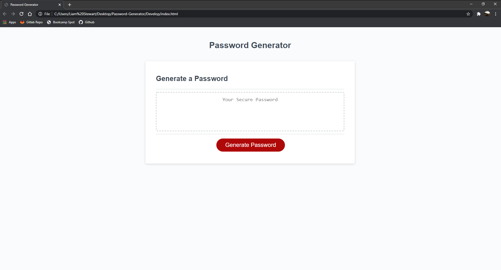

# Password-Generator
Are you in need of a quick and easy passowrd generator? Well you have come to the right place. This password generator that I have developed will generate a random password between 8 and 128 characters. This may contain **upper-case** letters, **lower-case** letters, **numbers**, and **special characters**.

<!--  -->
## Getting Started
Visit the live link [Here](https://liamstewartdev.github.io/Password-Generator/) and click "Generate Password" to begin the prompt. From there it will ask a few questions before generating your password: 
1. Between 8-128 how many characters would you like your password to be?
2. Would you like **upper case** letters?
3. Would you like **lower case** letters?
4. Would you like **numbers**?
5. Would you like **symbols**?
## Technologies Used
- HTML
- CSS
- Javascript

## Author Links
[LinkedIn](https://www.linkedin.com/in/liamsctewart/) 
[Github](https://github.com/LiamStewart8) 
[Deployed Link](https://liamstewartdev.github.io/Password-Generator/)